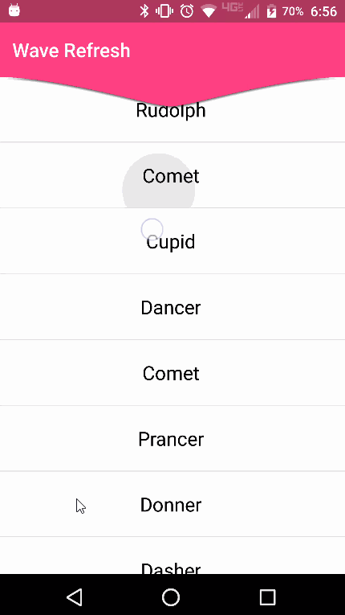

[](https://www.npmjs.com/package/nativescript-wave-refresh)
[](https://www.npmjs.com/package/nativescript-wave-refresh)

# NativeScript-Wave-Refresh :recycle:
NativeScript plugin for a custom pull-to-refresh layout.

## Demo



## Native Library
[Wave Swipe Refresh Layout](https://github.com/recruit-lifestyle/WaveSwipeRefreshLayout)

## Installation
From your command prompt/termial go to your app's root folder and execute:

`tns plugin add nativescript-wave-refresh`

## Usage

## XML
```XML
<page 
  xmlns="http://schemas.nativescript.org/tns.xsd" 
  xmlns:WR="nativescript-wave-refresh" loaded="pageLoaded">
  <ActionBar title="Wave Refresh" backgroundColor="#FF4081" color="#fff" />
  <stack-layout>
    <WR:WaveRefresh backgroundColor="#FF4081" refresh="{{ stopRefresh }}" id="waveRefresh">
      <list-view items="{{ users }}">
        <list-view.itemTemplate>
          <label text="{{ name }}" row="0" col="1" textWrap="true" class="message" />
        </list-view.itemTemplate>
      </list-view>
    </WR:WaveRefresh>
  </stack-layout>
</page>
```

## TS
```TS
import { WaveRefresh } from "nativescript-wave-refresh"

  public stopRefresh(args: any) {
    // Load more data here and then set 'refreshing = false' to end the refresh
    let waveRefresh: WaveRefresh = args.object;
    waveRefresh.refreshing = false;
  }

```


## Attributes
**refresh : function** *optional* - this event is triggered when you set the BoredRudoplh *refresh* property equal to false.

*backgroundColor* is supported to specify the background color of the wave refresh. This will help to blend it in with the ActionBar.

## API

### refreshing

Property. Notifies the widget that the refresh state has changed.